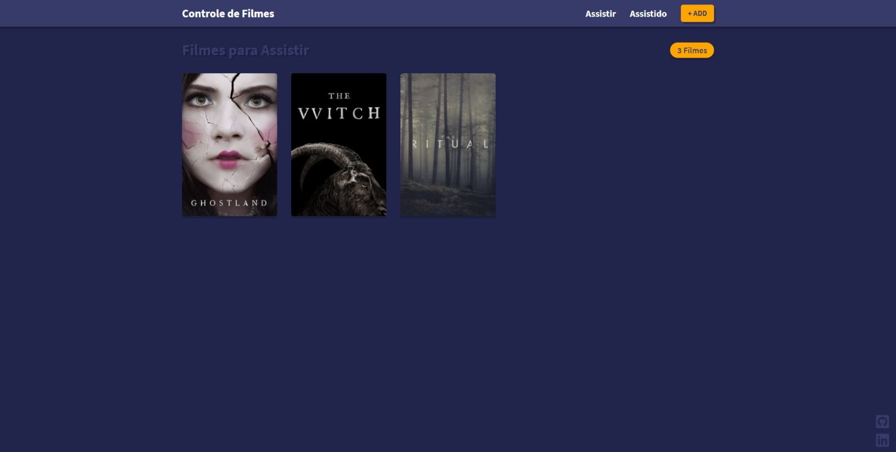
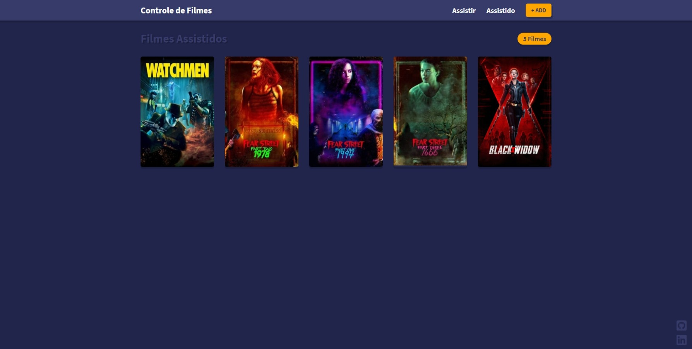
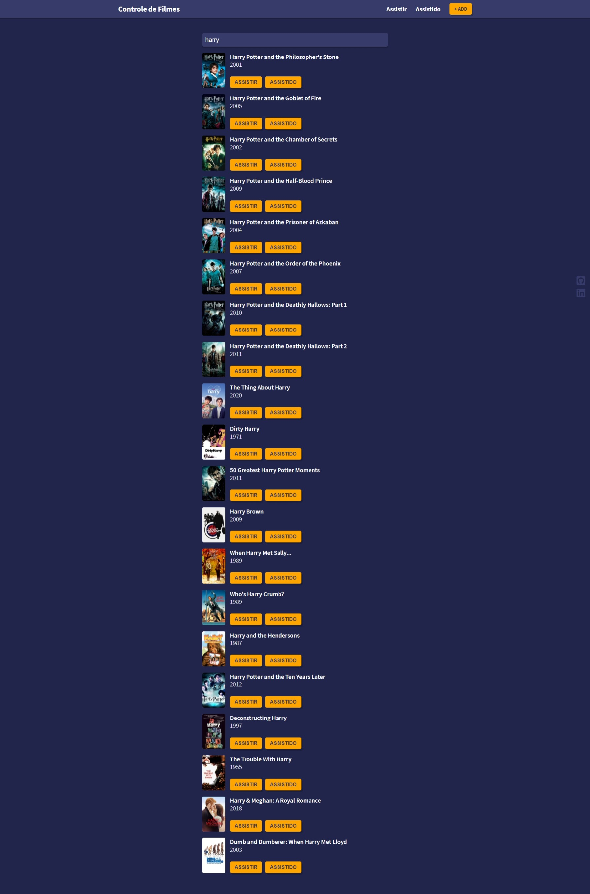

<h1 align="center">🎥 Controle de Filmes</h1>

  <strong>App desenvolvido como forma de estudo sobre REACT</strong>
   
  Aplicativo criado para controle de filmes, separados por: Filmes para Assistir e Filmes Assistidos, armazenados Local Storage

  

  

  

### 💻 Site 

- <strong>[Controle de Filmes](https://controlmovies.netlify.app/)</strong>

## 🚀 Tecnologias

- HTML
- CSS
- JavaScript

## 📙 Biblioteca
- REACT

## 🗃️ API
- https://www.themoviedb.org/
